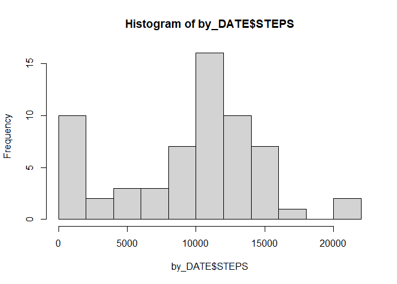
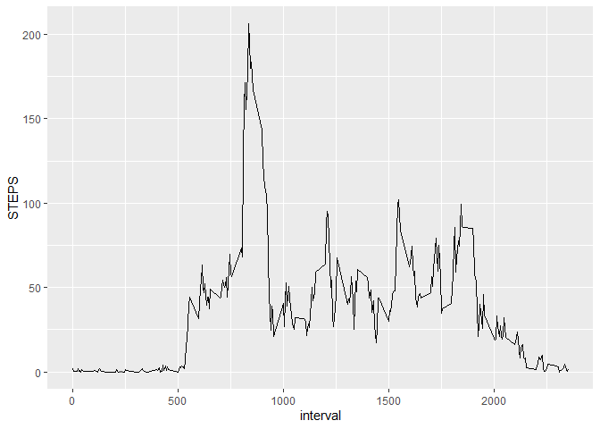
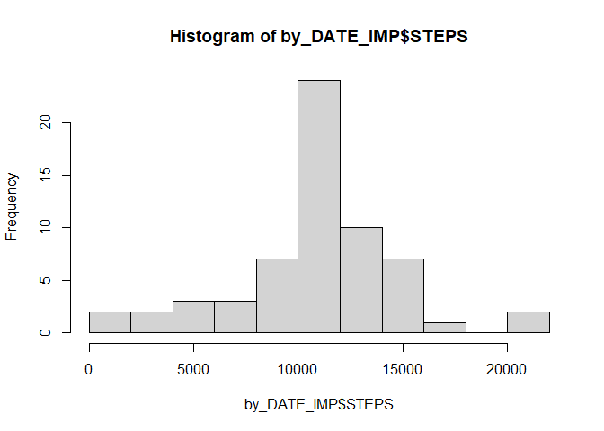
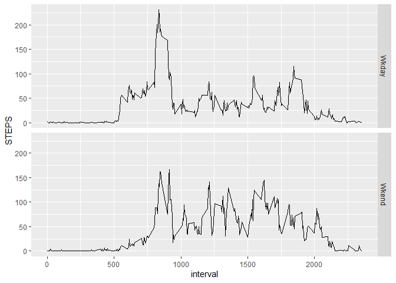

## Initialize the libraries


```r
library(tidyverse)
```

```
## ── Attaching core tidyverse packages ──────────────────────── tidyverse 2.0.0 ──
## ✔ dplyr     1.1.2     ✔ readr     2.1.4
## ✔ forcats   1.0.0     ✔ stringr   1.5.0
## ✔ ggplot2   3.4.2     ✔ tibble    3.2.1
## ✔ lubridate 1.9.2     ✔ tidyr     1.3.0
## ✔ purrr     1.0.1     
## ── Conflicts ────────────────────────────────────────── tidyverse_conflicts() ──
## ✖ dplyr::filter() masks stats::filter()
## ✖ dplyr::lag()    masks stats::lag()
## ℹ Use the conflicted package (<http://conflicted.r-lib.org/>) to force all conflicts to become errors
```

## Loading and preprocessing the data

1.  Load the data (i.e. read.csv())


```r
ACT <- read.csv("activity.csv")
```

2.  Process/transform the data (if necessary) into a format suitable for your analysis


```r
ACT <- ACT %>%
            mutate(wkday = wday(date, label = TRUE)) %>%
            mutate(DAY = ifelse(wkday %in% (c('Sat', 'Sun')), 'Wkend','Wkday'))
```

## What is mean total number of steps taken per day?

1.  Calculate the total number of steps taken per day


```r
by_DATE <-ACT %>% group_by(date) %>% summarise(STEPS=sum(steps, na.rm = TRUE))
by_DATE$STEPS
```

```
##  [1]     0   126 11352 12116 13294 15420 11015     0 12811  9900 10304 17382
## [13] 12426 15098 10139 15084 13452 10056 11829 10395  8821 13460  8918  8355
## [25]  2492  6778 10119 11458  5018  9819 15414     0 10600 10571     0 10439
## [37]  8334 12883  3219     0     0 12608 10765  7336     0    41  5441 14339
## [49] 15110  8841  4472 12787 20427 21194 14478 11834 11162 13646 10183  7047
## [61]     0
```

2.  Make a histogram of the total number of steps taken each day


```r
hist(by_DATE$STEPS, breaks = 10)
```

<!-- -->

3.  Calculate and report the mean and median of the total number of steps taken per day


```r
cat("Mean number of steps taken each day", mean(by_DATE$STEPS),"\n")
```

```
## Mean number of steps taken each day 9354.23
```

```r
cat("Median number of steps taken each day", median(by_DATE$STEPS),"\n")
```

```
## Median number of steps taken each day 10395
```

## What is the average daily activity pattern?

1.  Make a time series plot (i.e. type = "l") of the 5-minute interval (x-axis) and the average number of steps taken, averaged across all days (y-axis)


```r
by_INT <- ACT %>% group_by(interval) %>% summarise(STEPS=mean(steps, na.rm = TRUE)) 

ggplot(data=by_INT, aes(x=interval, y=STEPS)) + geom_line()
```

<!-- -->

2.  Which 5-minute interval, on average across all the days in the dataset, contains the maximum number of steps?


```r
max_step <- by_INT %>% filter(STEPS==max(STEPS))

cat("5-minute interval that contains the maximum number of steps:", max_step$interval,"\n")
```

```
## 5-minute interval that contains the maximum number of steps: 835
```

## Imputing missing values

1.  Calculate and report the total number of missing values in the dataset (i.e. the total number of rows with NAs)


```r
missing_rows <- ACT %>% filter(is.na(steps))
cat("total number of rows with NAs:", nrow(missing_rows),"\n")
```

```
## total number of rows with NAs: 2304
```

2.  Devise a strategy for filling in all of the missing values in the dataset. The strategy does not need to be sophisticated. For example, you could use the mean/median for that day, or the mean for that 5-minute interval, etc.

    *My strategy: I will use the mean steps by interval to impute any missing values.*

3.  Create a new dataset that is equal to the original dataset but with the missing data filled in.


```r
# I will use the mean steps by interval to impute any missing values.
ACT_IMP <- ACT %>% group_by(interval) %>%
    mutate(steps_IMP=ifelse(is.na(steps),mean(steps,na.rm=TRUE),steps))
```

4a. Make a histogram of the total number of steps taken each day and Calculate and report the mean and median total number of steps taken per day. Do these values differ from the estimates from the first part of the assignment?


```r
by_DATE_IMP <-ACT_IMP %>% group_by(date) %>% summarise(STEPS=sum(steps_IMP, na.rm = TRUE))
by_DATE_IMP$STEPS
```

```
##  [1] 10766.19   126.00 11352.00 12116.00 13294.00 15420.00 11015.00 10766.19
##  [9] 12811.00  9900.00 10304.00 17382.00 12426.00 15098.00 10139.00 15084.00
## [17] 13452.00 10056.00 11829.00 10395.00  8821.00 13460.00  8918.00  8355.00
## [25]  2492.00  6778.00 10119.00 11458.00  5018.00  9819.00 15414.00 10766.19
## [33] 10600.00 10571.00 10766.19 10439.00  8334.00 12883.00  3219.00 10766.19
## [41] 10766.19 12608.00 10765.00  7336.00 10766.19    41.00  5441.00 14339.00
## [49] 15110.00  8841.00  4472.00 12787.00 20427.00 21194.00 14478.00 11834.00
## [57] 11162.00 13646.00 10183.00  7047.00 10766.19
```


```r
hist(by_DATE_IMP$STEPS, breaks = 10)
```

<!-- -->


```r
cat("Mean number of steps taken each day", mean(by_DATE_IMP$STEPS),"\n")
```

```
## Mean number of steps taken each day 10766.19
```

```r
cat("Median number of steps taken each day", median(by_DATE_IMP$STEPS),"\n")
```

```
## Median number of steps taken each day 10766.19
```

*My response: Histogram contains a lot less low values and became more normal*

4b. What is the impact of imputing missing data on the estimates of the total daily number of steps? *My response: total daily number of steps are higher on some of the days that used to have no steps.*

## Are there differences in activity patterns between weekdays and weekends?

1. Create a new factor variable in the dataset with two levels -- "weekday" and "weekend" indicating whether a given date is a weekday or weekend day.


```r
table(ACT_IMP$DAY)
```

```
## 
## Wkday Wkend 
## 12960  4608
```
2. Make a panel plot containing a time series plot (i.e. type = "l") of the 5-minute interval (x-axis) and the average number of steps taken, averaged across all weekday days or weekend days (y-axis). 

```r
by_INT_IMP <- ACT_IMP %>% group_by(DAY, interval) %>% summarise(STEPS=mean(steps_IMP, na.rm = TRUE)) 
```

```
## `summarise()` has grouped output by 'DAY'. You can override using the `.groups`
## argument.
```

```r
ggplot(data=by_INT_IMP, aes(x=interval, y=STEPS)) + geom_line() + facet_grid(DAY ~ .)
```

<!-- -->

